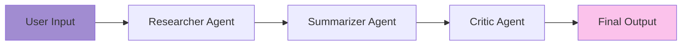

# 🤖 AI Research Assistant

<div align="center">


**An intelligent multi-agent research assistant powered by Google's Gemini AI and LangGraph**

[Features](#-features) • [Installation](#-installation) • [Usage](#-usage) • [Architecture](#-architecture) • [Contributing](#-contributing)

</div>

---

## 📖 Overview

AI Research Assistant is a sophisticated web application that leverages **multi-agent architecture** to provide comprehensive research, summarization, and critical analysis on any topic. Built with LangGraph and powered by Google's Gemini 2.0 Flash model, it orchestrates three specialized AI agents to deliver high-quality, evaluated content.

### 🎯 What Makes It Special?

- **Multi-Agent Workflow**: Three specialized agents work in harmony
- **Conversational Memory**: Maintains context across interactions
- **Real-time Processing**: Instant research and analysis
- **Beautiful UI**: Modern, responsive interface with gradient design
- **Production-Ready**: Built with FastAPI for scalability

---

## ✨ Features

### 🔍 **Research Agent**
- Conducts in-depth research on any topic
- Maintains conversation history for contextual understanding
- Provides concise, relevant information

### 📝 **Summarizer Agent**
- Distills complex research into clear summaries
- Preserves key insights while reducing verbosity
- Context-aware summarization

### 💬 **Critic Agent**
- Evaluates summaries for clarity and accuracy
- Provides constructive feedback
- Ensures quality control of outputs

### 🎨 **User Interface**
- Modern gradient design (Purple to Pink)
- Responsive layout
- Scrollable results display
- Clean, intuitive UX

---

## 🏗️ Architecture

### Agent Workflow



### System Design

```
┌─────────────────────────────────────────┐
│           FastAPI Backend               │
├─────────────────────────────────────────┤
│                                         │
│  ┌──────────────────────────────────┐  │
│  │     LangGraph State Machine      │  │
│  ├──────────────────────────────────┤  │
│  │  ┌────────────┐                 │  │
│  │  │ Researcher │──┐              │  │
│  │  └────────────┘  │              │  │
│  │                  ▼              │  │
│  │  ┌────────────┐                 │  │
│  │  │Summarizer  │──┐              │  │
│  │  └────────────┘  │              │  │
│  │                  ▼              │  │
│  │  ┌────────────┐                 │  │
│  │  │   Critic   │──┐              │  │
│  │  └────────────┘  │              │  │
│  │                  ▼              │  │
│  │              [Output]           │  │
│  └──────────────────────────────────┘  │
│                                         │
│  ┌──────────────────────────────────┐  │
│  │   Conversation Buffer Memory     │  │
│  └──────────────────────────────────┘  │
└─────────────────────────────────────────┘
              ▲
              │
    ┌─────────┴─────────┐
    │   Gemini 2.0 API  │
    └───────────────────┘
```

### Tech Stack

| Component | Technology |
|-----------|-----------|
| **Backend** | FastAPI |
| **AI Framework** | LangChain + LangGraph |
| **LLM** | Google Gemini 2.0 Flash |
| **Memory** | ConversationBufferMemory |
| **Frontend** | Jinja2 Templates + CSS |
| **State Management** | TypedDict (Python) |

---

## 🚀 Installation

### Prerequisites

- Python 3.8 or higher
- Google Gemini API Key ([Get it here](https://makersuite.google.com/app/apikey))

### Step 1: Clone the Repository

```bash
git clone https://github.com/janaelpardisi/ai-research-assistant.git
cd ai-research-assistant
```

### Step 2: Create Virtual Environment

```bash
python -m venv venv

# On Windows
venv\Scripts\activate

# On macOS/Linux
source venv/bin/activate
```

### Step 3: Install Dependencies

```bash
pip install -r requirements.txt
```

### Step 4: Configure Environment

Create a `.env` file in the project root:

```env
GOOGLE_API_KEY=your_gemini_api_key_here
```

⚠️ **Important**: Never commit your `.env` file to version control!

Add this to your `.gitignore`:

```
.env
__pycache__/
*.pyc
venv/
.vscode/
*.log
```

---

## 💻 Usage

### Running the Application

```bash
uvicorn app:app --reload
```

The application will start at `http://localhost:8000`

### Using the Assistant

1. **Enter Your Topic**: Type any research topic in the input field
2. **Submit**: Click the "Ask" button
3. **Review Results**: The system will display:
   - 🔍 **Research**: Comprehensive findings
   - 📝 **Summary**: Concise overview
   - 💬 **Critique**: Quality evaluation

### Example Topics

```
"Quantum Computing"
"Machine Learning in Healthcare"
"Sustainable Energy Solutions"
"Blockchain Technology"
"Space Exploration Technologies"
```

---

## 📁 Project Structure

```
ai-research-assistant/
│
├── Agents.py              # Multi-agent logic & LangGraph workflow
├── app.py                 # FastAPI application
├── requirements.txt       # Python dependencies
├── .env                   # Environment variables (not in repo)
├── .gitignore            # Git ignore file
├── README.md             # This file
│
├── templates/
│   └── index.html        # Main UI template
│
└── static/
    └── style.css         # Styling
```

---

## 🔧 Configuration

### Adjusting LLM Parameters

In `Agents.py`, modify the LLM initialization:

```python
llm = ChatGoogleGenerativeAI(
    model="gemini-2.0-flash",
    temperature=0.2  # Lower = more focused, Higher = more creative
)
```

**Temperature Guide:**
- `0.0 - 0.3`: Focused, deterministic responses
- `0.4 - 0.7`: Balanced creativity and accuracy
- `0.8 - 1.0`: More creative and varied outputs

### Customizing Prompts

Each agent has a customizable prompt in `Agents.py`:

```python
def researcher(state):
    prompt = f"""
    Your custom research prompt here
    Topic: {topic}
    """
```

### Changing the Port

```bash
uvicorn app:app --reload --port 8001
```

---

## 🔄 How It Works

### Agent Pipeline

1. **Researcher Agent** receives the user's topic
2. Accesses conversation memory for context
3. Conducts research and generates comprehensive information
4. **Summarizer Agent** processes the research
5. Creates a concise, clear summary
6. **Critic Agent** evaluates the summary
7. Provides feedback on clarity and accuracy
8. All results are returned to the user

### State Management

The application uses a `TypedDict` to maintain state across agents:

```python
class AgentState(TypedDict):
    topic: str        # User's research topic
    research: str     # Researcher's output
    summary: str      # Summarizer's output
    feedback: str     # Critic's evaluation
    conversation: str # Memory context
```

---

## 🤝 Contributing

Contributions are welcome! Here's how:

1. **Fork** the repository
2. **Create** a feature branch (`git checkout -b feature/AmazingFeature`)
3. **Commit** your changes (`git commit -m 'Add some AmazingFeature'`)
4. **Push** to the branch (`git push origin feature/AmazingFeature`)
5. **Open** a Pull Request

### Development Guidelines

- Follow PEP 8 style guide
- Add comments for complex logic
- Test your changes locally
- Update README if adding new features

---

## 🐛 Troubleshooting

### Common Issues

**Issue**: `ModuleNotFoundError: No module named 'langchain'`

**Solution**:
```bash
pip install -r requirements.txt
```

---

**Issue**: `API Key Error` or `Invalid API Key`

**Solution**:
- Ensure your `.env` file contains a valid `GOOGLE_API_KEY`
- Verify the key at [Google AI Studio](https://makersuite.google.com/)
- Make sure `.env` is in the root directory

---

**Issue**: `Port already in use`

**Solution**:
```bash
# Use a different port
uvicorn app:app --reload --port 8001
```

---

**Issue**: Templates not found

**Solution**:
- Ensure `templates/` folder exists
- Check `index.html` is in `templates/`
- Verify file structure matches the documentation

---

## 📊 Performance

- **Response Time**: ~2-5 seconds per query
- **Concurrent Users**: Supports multiple simultaneous requests
- **Memory**: Maintains conversation history per session
- **Scalability**: FastAPI enables easy horizontal scaling

---

## 🔐 Security Best Practices

- ✅ Environment variables for sensitive data
- ✅ Input validation on forms
- ✅ No client-side API key exposure
- ⚠️ Add rate limiting for production use
- ⚠️ Implement authentication for multi-user deployments

### Recommended Production Additions

```python
# Add rate limiting
from slowapi import Limiter, _rate_limit_exceeded_handler
from slowapi.util import get_remote_address

limiter = Limiter(key_func=get_remote_address)
app.state.limiter = limiter
```

---

## 🚀 Deployment

### Deploy to Railway

1. Push your code to GitHub
2. Connect Railway to your repository
3. Add `GOOGLE_API_KEY` environment variable
4. Deploy automatically

### Deploy to Render

1. Create a new Web Service
2. Connect your repository
3. Add environment variables
4. Use build command: `pip install -r requirements.txt`
5. Use start command: `uvicorn app:app --host 0.0.0.0 --port $PORT`

---

## 📚 Resources

- [LangChain Documentation](https://python.langchain.com/)
- [LangGraph Guide](https://langchain-ai.github.io/langgraph/)
- [FastAPI Docs](https://fastapi.tiangolo.com/)
- [Google Gemini API](https://ai.google.dev/)

---

## 📝 License

This project is licensed under the MIT License - see the [LICENSE](LICENSE) file for details.

```
MIT License

Copyright (c) 2024 Jana Ashraf

Permission is hereby granted, free of charge, to any person obtaining a copy
of this software and associated documentation files...
```

---

## 👨‍💻 Author

**Jana Ashraf**
- GitHub: [@janaelpardisi](https://github.com/janaelpardisi)
- LinkedIn: [Jana Ashraf](https://www.linkedin.com/in/jana-ashraf-elpardisi)

---

## 🙏 Acknowledgments

- [LangChain](https://langchain.com/) - For the amazing AI framework
- [LangGraph](https://github.com/langchain-ai/langgraph) - For state machine capabilities
- [Google Gemini](https://deepmind.google/technologies/gemini/) - For powerful AI models
- [FastAPI](https://fastapi.tiangolo.com/) - For the fast web framework

---

## 📈 Roadmap

Future enhancements:

- [ ] Add user authentication
- [ ] Implement multiple LLM providers
- [ ] Add export functionality (PDF, Markdown)
- [ ] Create API endpoints for programmatic access
- [ ] Add caching layer for repeated queries
- [ ] Implement streaming responses
- [ ] Add support for file uploads and analysis

---

<div align="center">

**Made with Jana❤️ and AI**

[⬆ Back to Top](#-ai-research-assistant)

</div>
